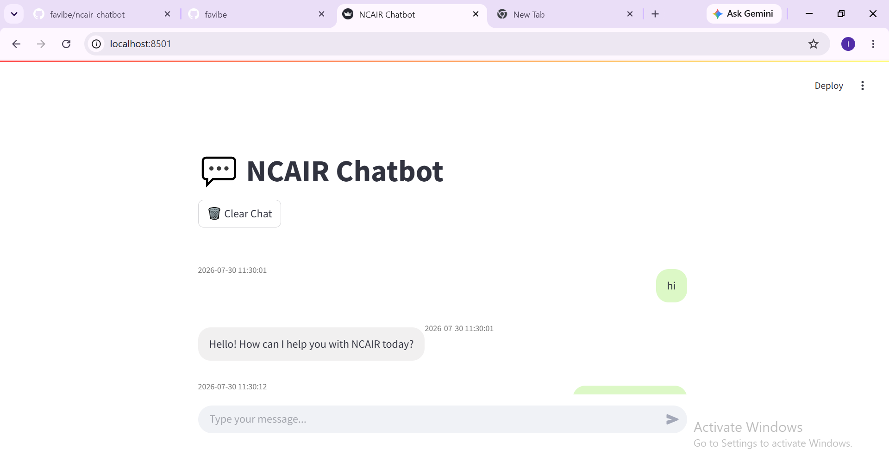
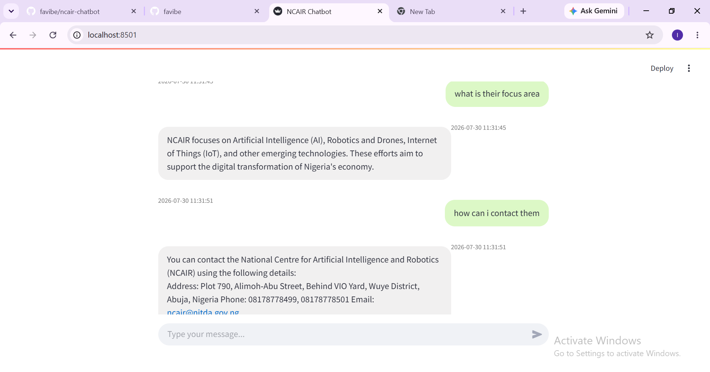
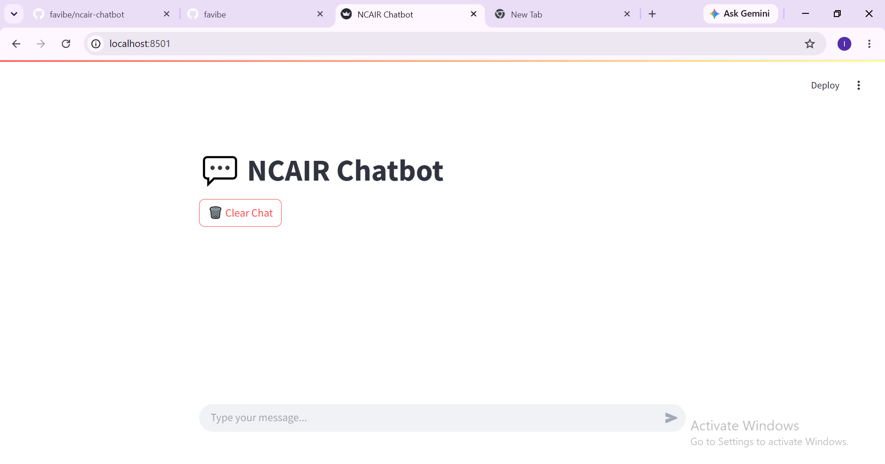

# 🤖 NCAIR AI Chatbot


An AI-powered conversational chatbot built for the **National Centre for Artificial Intelligence and Robotics (NCAIR)**. It combines a PyTorch intent-classification neural network, conversation memory, fuzzy matching, and live web scraping into a single Streamlit web application that answers questions about NCAIR and its initiatives.

---

## 🖼️ Application Preview

### Home Screen


### Conversation


### Clear Chat


---

## 📖 Project Overview

The NCAIR Chatbot provides quick, conversational access to information about NCAIR — its mission, values, programs (AI Fund, AI Collective), leadership, and completed projects — without needing to browse the website manually.

Rather than relying only on hardcoded rules, it layers several techniques together:

- **Intent classification** via a trained neural network (fast, generalizes to similar phrasings)
- **Fuzzy string matching** as a secondary check against known patterns
- **Live web scraping** of the NCAIR site as a last-resort fallback, so answers stay grounded in real content instead of guessing
- **Persistent, per-user conversation memory**
- **Spelling correction** on incoming messages before fallback matching

## ✨ Features

- 🤖 AI-powered intent classification (PyTorch feed-forward neural network)
- 🧠 Confidence-based response pipeline: neural net → fuzzy match → live scrape
- 💬 Persistent conversation history, stored per user
- 🌐 Automatic web scraping of NCAIR pages when no confident intent is found
- 🔍 Fuzzy string matching (RapidFuzz) for near-miss phrasing
- ✍️ Automatic spelling correction before fallback matching
- 📚 JSON-based, editable knowledge base (`intents.json`)
- 🗑️ Clear-chat functionality
- 📝 Timestamped messages
- 🔒 User input escaped before rendering (XSS-safe chat display)
- ⚙️ Modular project architecture — UI, orchestration, model, and scraping are cleanly separated

---

## 🏗️ System Architecture

```text
User Input
    │
    ▼
Load conversation history (memory.py)
    │
    ▼
Intent Classification (PyTorch Neural Network)
    │
    ├── Confidence ≥ threshold ──────► Return intent response
    │
    └── Confidence < threshold
              │
              ▼
        Fuzzy Match against intents.json (RapidFuzz)
              │
              ├── Good match ─────────► Return matched response
              │
              └── No good match
                        │
                        ▼
                Extract keywords from recent context
                        │
                        ▼
                Scrape NCAIR website for relevant paragraph
                        │
                        ▼
                Return scraped content (or graceful fallback message)
    │
    ▼
Save turn to memory.json → Display in Streamlit UI
```

---

## 🧠 The AI Model

A feed-forward neural network (PyTorch) classifies user messages into one of the trained intent tags.

**Architecture:** Input layer → Hidden layer (ReLU) → Hidden layer (ReLU) → Output layer (one unit per intent tag)

**Training pipeline** (`train.py`):
1. Load intent patterns from `intents.json`
2. Tokenize each pattern (NLTK)
3. Stem words (Porter Stemmer)
4. Build vocabulary and convert patterns to Bag-of-Words vectors
5. Encode intent labels (scikit-learn `LabelEncoder`)
6. Train the network (Cross Entropy Loss, Adam optimizer)
7. Save weights + vocabulary + tags to `intent_model.pth`

**Training configuration:**

| Parameter | Value |
|---|---|
| Batch size | 8 |
| Hidden size | 64 |
| Learning rate | 0.001 |
| Epochs | 1000 |
| Loss function | Cross Entropy Loss |
| Optimizer | Adam |
| Activation | ReLU |
| Final training loss | *[0.0421 at epoch 1000]* |

> Re-run `python train.py` any time `intents.json` changes, and note the final printed loss here for your defense.

---

## 🌐 Web Scraping Fallback

When neither the neural net nor fuzzy matching confidently identifies an intent, the chatbot scrapes selected NCAIR pages for a paragraph relevant to recent conversation keywords:

- Home
- About Us
- Work Done So Far
- AI Fund
- AI Collective
- Contact

This keeps the bot able to say *something* useful even for questions outside its trained intents, grounded in real site content rather than a hallucinated guess.

## 💬 Conversation Memory

Each turn (user message + bot reply + timestamp) is persisted to `memory.json`, keyed by user ID, via `memory.py`. This is the **single source of truth** for chat state — `app.py` reads from it on load and displays whatever `chatbot.py` returns after a turn, rather than managing its own separate copy.

Users can clear their history at any time via the **Clear Chat** button.

---

## 🛠️ Technologies Used

- **Python 3**
- **PyTorch** — neural network training and inference
- **NLTK** — tokenization
- **NumPy** — bag-of-words vectors
- **scikit-learn** — label encoding
- **Streamlit** — web chat interface
- **Requests + BeautifulSoup** — web scraping
- **RapidFuzz** — fuzzy string matching
- **Autocorrect** — spelling correction

---

## 📁 Project Structure

```text
ncair-chatbot/
│
├── app.py               # Streamlit UI: chat rendering, session state, clear-chat
├── chatbot.py             # Orchestrator: neural net → fuzzy match → scrape fallback
├── model.py                 # Neural network definition + inference logic
├── scrapper.py                 # Fuzzy matching + live NCAIR site scraping
├── memory.py                      # Per-user chat history persistence
├── train.py                         # Trains the intent model from intents.json
│
├── intents.json                       # Training patterns + responses (committed)
├── intent_model.pth                     # Trained model weights (gitignored — see below)
├── memory.json                            # Runtime chat history (gitignored)
│
├── images/
│   ├── home.png
│   ├── conversation.png
│   └── clear_chat.png
│
├── requirements.txt
├── README.md
├── .gitignore
└── LICENSE
```

### A note on what's excluded from this repo

`intent_model.pth` and `memory.json` are listed in `.gitignore` and are **not** pushed to GitHub:

- **`intent_model.pth`** — the trained model weights. Even though it's small (~105KB locally), it's a *derived build artifact*, fully regenerable from `intents.json` via `train.py`. Keeping it out of version control keeps the repo focused on source data/code rather than compiled output.
- **`memory.json`** — runtime-generated conversation logs. Excluded since it contains actual chat content and has no reason to be versioned.

`intents.json` itself **is** committed — it's the actual training data and knowledge base, not a build artifact, and is small enough and non-sensitive enough to belong in source control.

---

## ⚙️ Installation

**1. Clone the repository**
```bash
git clone https://github.com/favibe/ncair-chatbot.git
cd ncair-chatbot
```

**2. Create and activate a virtual environment**

Windows:
```bash
python -m venv venv
venv\Scripts\activate
```

macOS/Linux:
```bash
python3 -m venv venv
source venv/bin/activate
```

**3. Install dependencies**
```bash
pip install -r requirements.txt
```

## 🧠 Preparing the Model

The trained model file is intentionally excluded from GitHub (see note above), so generate it locally first:

```bash
python train.py
```

This trains on `intents.json` and saves `intent_model.pth` in the project root — required before the app will run.

## ▶️ Running the Chatbot

```bash
streamlit run app.py
```

Streamlit opens the app in your browser at a local address (typically `http://localhost:8501`).

---

## 💡 Example Questions

- "What is NCAIR?"
- "Tell me about the AI Collective."
- "What projects has NCAIR completed?"
- "How do I contact NCAIR?"
- "What does innovation mean at NCAIR?"
- "Who is the Director of NCAIR?"
- "Explain NCAIR's mission."

---

## 🎯 Skills Demonstrated

- Python programming & object-oriented design
- Natural Language Processing (tokenization, stemming, bag-of-words)
- Neural network training and inference with PyTorch
- Confidence-based prediction and decision routing
- Web scraping and HTML parsing (BeautifulSoup)
- Fuzzy string matching
- Persistent application state / conversation memory
- Streamlit application development
- Modular, multi-file Python project architecture
- Debugging and fixing real data/state-management bugs (see below)

## 🚀 Possible Future Improvements

- Expand the intent dataset and add a validation/test split with accuracy/precision/recall metrics
- Replace bag-of-words with a stronger embedding-based NLP approach
- Deduplicate shared logic between `train.py` and `model.py` into a common `utils.py`
- Support dynamic user IDs / authentication instead of a single fixed user
- Add automated tests
- Containerize and deploy publicly

---

## 📄 License

This project is licensed under the terms in the [LICENSE](LICENSE) file (MIT).

## 👩🏽‍💻 Author

**Favour Ibe**
Software Engineering, developed during an internship at NCAIR (National Centre for Artificial Intelligence and Robotics) as part of a Python, NLP, and applied AI learning journey.
